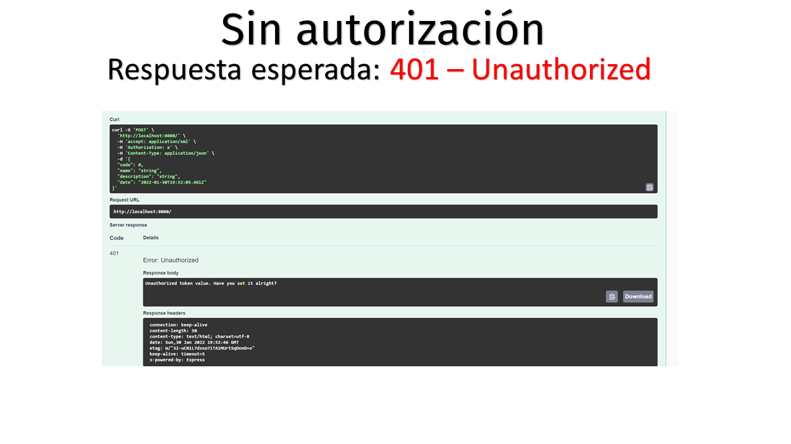

# Prueba técnica de Samuel Encinas Plaza

## Implementación
- Se ha utilizado **node.js** y **Express** como motor principal y framework respectivamente para el microback. Se ha optado por usar Express para facilitar el sistema de gestión de las peticiones. Se podría haber implementado de una forma más primitiva mediante el módulo HTTP integrado en Node por defecto.
- Asimismo, se ha utilizado **pino** como *sistema de logging*, guardando en un log cada operación del back. Se ha decidido utilizar este módulo ya que es el que he usado anteriormente y me ha dado buenos resultados.
- Por último, se ha utilizado **swagger 2.0** para la documentación del modelo de Datos y de la operación principal (y me ha dado algún que otro problemilla, lo conseguí resolver 30min después de la entrega y por eso no subió en el primer commit y hay dos commit posteriores al primero)
## Funcionamiento
- **npm start** para ejecutar el servidor
- **localhost:8080/** con los datos correctos de Authentication y body para realizar la petición
- **localhost:8080/api-docs** desde el navegador para acceder al Swagger
## Pruebas




# test NodeJS (Enunciado)

  

Desarrolla un micro-banckend que cumpla con los siguientes parametros:

  

1. Puerto de servicio: 8080

2. Requiere Authentication a través de una cabecera.

3. Válidar valor Authentication con los valores del archivo validateAuth.json y la fecha de expiración con el momento actual.

4. Requiere datos con la estructura:

```json

{

"code": 15, // Integer | Required

"name": "Test", // String | Required

"description": "Description", // String | Optional

"date": "2022-05-05T10:00:00"  // Date | Required

}

```

6. Validar la estructura recibida.

7. Responder con la diferencia de tiempo que hay entre la fecha recibida y la fecha de expiracion del archivo validateAuth.json

8. Integrar un sistema de log que registre cada una de las tareas del micro-backend.

9. Define el servicio web mediante Swagger 2.0 u OpenAPI 3.0
